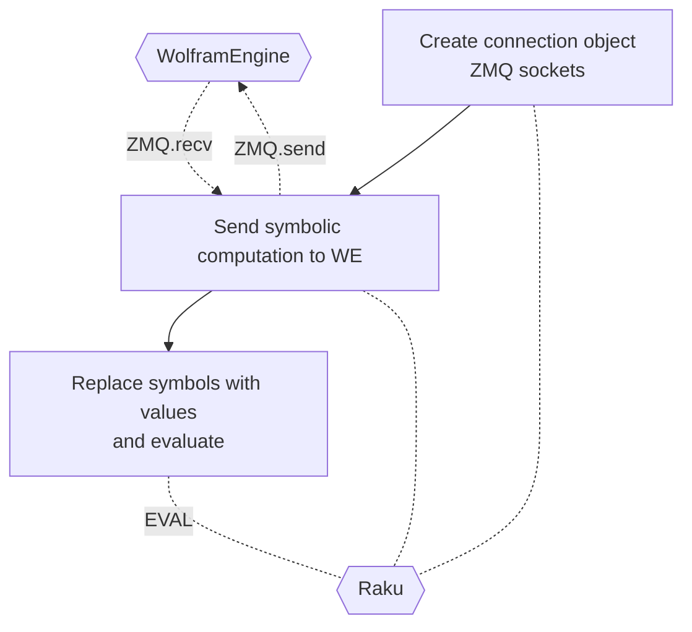

# Raku Proc::ZMQed

This package, "Proc::ZMQed", provides external evaluators (Julia, Mathematica, Python, R, etc.) via 
[ZeroMQ (ZMQ)](https://zeromq.org).

Functionality-wise, a closely related Raku package is 
["Text::CodeProcessing"](https://raku.land/zef:antononcube/Text::CodeProcessing), 
[AAp1]. For example, Raku can be used in Mathematica notebooks with [AAp1] and [AAp2]; see [AA1] for more details.
With this package, "Proc::ZMQed", we can use Mathematica in Raku sessions. 

-----

## Installation

From GitHub:

```
zef install https://github.com/antononcube/Raku-Proc-ZMQed.git
```

From [Zef ecosystem](https://raku.land):

```
zef install Proc::ZMQed
```

-----

## Usage example: symbolic computation with Mathematica

*...aka Wolfram Language (WL).*

The following examples shows:

- Establishing connection to [Wolfram Engine](https://www.wolfram.com/engine/) (which is free for developers.)

- Sending a formula for symbolic algebraic expansion.

- Getting the symbolic result and evaluating it as a Raku expression.

```perl6
use Proc::ZMQed;

# Make object
my Proc::ZMQed::Mathematica $wlProc .= new(url => 'tcp://127.0.0.1', port => '5550');

# Start the process (i.e. Wolfram Engine)
$wlProc.start-proc;

my $cmd = 'Expand[(x+y)^4]';
my $wlRes = $wlProc.evaluate($cmd);
say "Sent : $cmd";
say "Got  :\n $wlRes";

# Send computation to Wolfram Engine
# and get the result in Fortran form.
say '-' x 120;
$cmd = 'FortranForm[Expand[($x+$y)^4]]';
$wlRes = $wlProc.evaluate($cmd);
say "Sent : $cmd";
say "Got  : $wlRes";

# Replace symbolic variables with concrete values 
my $x = 5;
my $y = 3;

use MONKEY-SEE-NO-EVAL;
say 'EVAL($wlRes) : ', EVAL($wlRes);

# Terminate process
$wlProc.terminate;
```

**Remark:** Mathematica can have variables that start with `$`, which is handy if we want to
tre WE results as Raku expressions.

Here is a corresponding flowchart:



------

## Setup

In this section we outline setup for different programming languages as "servers."

Generally, there are two main elements to figure out:

- What is the concrete Command Line Interface (CLI) name to use?

  - And related code option. E.g. `julia -e` or `wolframscript -code`.
  
- Is ZMQ installed on the server system?


The CLI names can be specified with the option `cli-name`.
The code options can be specified with `code-option`.

### Julia

In order to setup ZMQ computations with Julia start Julia and execute the commands:

```julia
using Pkg
Pkg.add("ZMQ")
Pkg.add("JSON")
Pkg.add("LinearAlgebra")
```

(Also, see the instructions at ["Configure Julia for ExternalEvaluate"](https://reference.wolfram.com/language/workflow/ConfigureJuliaForExternalEvaluate.html).) 

By default "Proc::ZMQed::Julia" uses the CLI name `julia`. Here is an alternative setup:

```{perl6, eval=FALSE}
my Proc::ZMQed::Julia $juliaProc .= new(url => 'tcp://127.0.0.1',
                                        port => '5560',
                                        cli-name => '/Applications/Julia-1.8.app/Contents/Resources/julia/bin/julia');
```

### Mathematica

Install [Wolfram Engine (WE)](https://www.wolfram.com/engine/). (As it was mentioned above, WE is free for developers. WE has ZMQ functionalities "out of the box.")

Make sure `wolframscript` is installed. (This is the CLI name used with "Proc::ZMQed::Mathematica".)

### Python

Install the ZMQ library ["PyZMQ"](https://pypi.org/project/pyzmq/). For example, with:

```
python -m pip install --user pyzmq
```

By default "Proc::ZMQed::Python" uses the CLI name `python`.
Here we connect to a Python virtual environment (made and used with miniforge).

```{perl6, eval=FALSE}
my Proc::ZMQed::Python $pythonProc .= new(url => 'tcp://127.0.0.1', 
                                          port => '5554', 
                                          cli-name => $*HOME ~ '/miniforge3/envs/SciPyCentric/bin/python');
```

------

## Implementation details

There is a general role "Proc::ZMQed::Abstraction" that combines the design patterns 
Builder, Template Method, and Strategy. Here is the corresponding UML diagram:

```perl6, output-lang=mermaid, output-prompt=NONE
use UML::Translators;
to-uml-spec(<Proc::ZMQed::Abstraction Proc::ZMQed::Julia Proc::ZMQed::Mathematica Proc::ZMQed::Python Proc::ZMQed::R Proc::ZMQed::Raku>, format=>'mermaid');
```

(Originally, "Proc::ZMQed::Abstraction" was named "Proc::ZMQish", but the former seems a better fit for the role.)

The ZMQ connections are simple REP/REQ. It is envisioned that more complicated ZMQ patterns can be implemented in
subclasses. I have to say though, that my attempts to implement 
["Lazy Pirate"](https://zguide.zeromq.org/docs/chapter4/)
were very unsuccessful because of the half-implemented (or missing) polling functionalities in [ASp1].
(See the comments [here](https://github.com/arnsholt/Net-ZMQ/blob/master/lib/Net/ZMQ4/Poll.pm6).)


------

## TODO

1. [ ] TODO Robust, comprehensive ZMQ-related failures handling.

2. [ ] TODO More robust ZMQ patterns. 

   - Like the "Lazy Pirate" mentioned above.

3. [ ] TODO Implement "Proc::ZMQed::Java".

4. [ ] TODO Better message processing in "Proc::ZMQed::R". 

5. [ ] TODO Verify that "Proc::ZMQed::JavaScript" is working.
  
   - Currently, I have problems install ZMQ in JavaScript.

------

## References

### Articles

[AA1] Anton Antonov,
["Connecting Mathematica and Raku"](https://rakuforprediction.wordpress.com/2021/12/30/connecting-mathematica-and-raku/),
(2021),
[RakuForPrediction at WordPress]([https://rakuforprediction.wordpress.com/).


### Packages

[AAp1] Anton Antonov
[Text::CodeProcessing Raku package](https://github.com/antononcube/Raku-Text-CodeProcessing),
(2021-2022),
[GitHub/antononcube](https://github.com/antononcube).

[AAp2] Anton Antonov,
[RakuMode Mathematica package](https://github.com/antononcube/ConversationalAgents/blob/master/Packages/WL/RakuMode.m),
(2020-2021),
[ConversationalAgents at GitHub/antononcube](https://github.com/antononcube/ConversationalAgents).

[ASp1] Arne Skjærholt,
[Net::ZMQ](https://github.com/arnsholt/Net-ZMQ),
(2017),
[GitHub/arnsholt](https://github.com/arnsholt).
