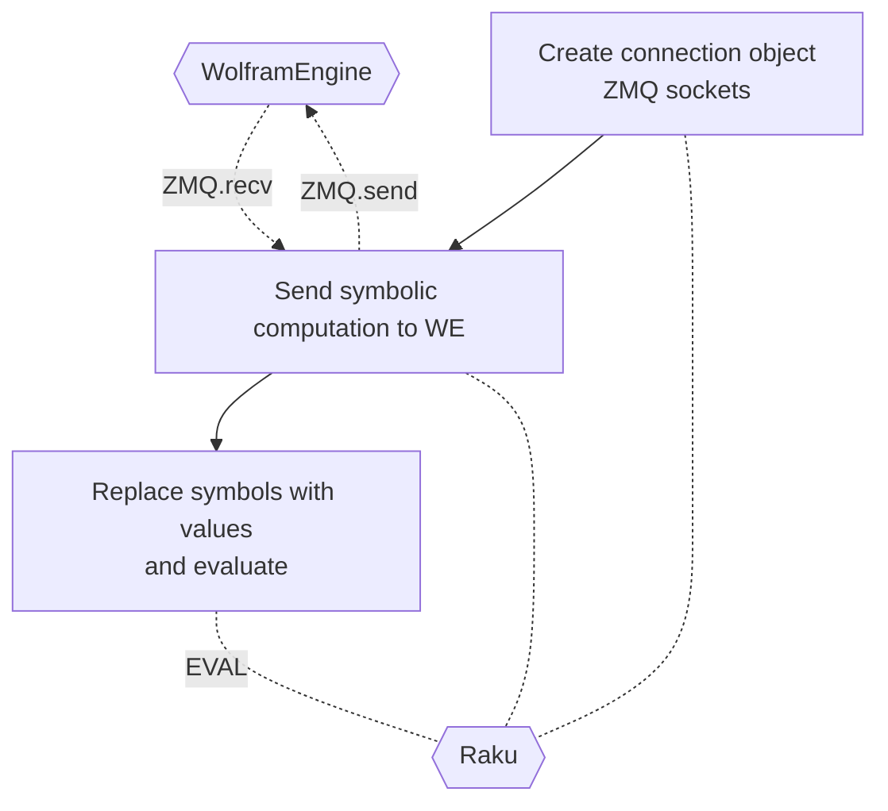

# Raku Proc::ZMQed

This package, "Proc::ZMQed", provides external evaluators (Mathematica, Python, R, etc.) via 
[ZerpMQ (ZMQ)](https://zeromq.org).

-----

## Mathematica 

*...aka Wolfram Language (WL).*

The following examples shows:

- Establishing connection of [Wolfram Engine](https://www.wolfram.com/engine/) (which is free for developers.)

- Sending a formula for symbolic expansion.

- Getting the symbolic result and evaluating as a Raku expression.

```perl6
use Proc::ZMQed::Mathematica;

# Make object
my Proc::ZMQed::Mathematica $wlProc .= new(url => 'tcp://127.0.0.1', port => '5550');

# Start the process (i.e. Wolfram Engine)
$wlProc.start-proc;

# Send computation to Wolfram Engine
# and get the result in Fortran form
my $wlRes = $wlProc.evaluate('FortranForm[Expand[($x+$y)^4]]');
say '$wlRes       : ', $wlRes;

# Replace symbolic variables with concrete values 
my $x = 5;
my $y = 3;

use MONKEY-SEE-NO-EVAL;
say 'EVAL($wlRes) : ', EVAL($wlRes);

# Terminate process
$wlProc.terminate;
```

**Remark:** Mathematica can have variables that start with `$`, which is handy if we want to
tre WE results as Raku expressions.

Here is a corresponding flowchart:



------

## Implementation detail

There is a general role "Proc::ZMQed::Abstraction" that combines the design patterns 
Builder, Template Method, and Strategy. Here is the corresponding UML diagram:

```perl6, output-lang=mermaid, output-prompt=NONE
use UML::Translators;
to-uml-spec(<Proc::ZMQed::Abstraction Proc::ZMQed::Mathematica Proc::ZMQed::Python Proc::ZMQed::R Proc::ZMQed::Raku>, format=>'mermaid');
```

------

## References

