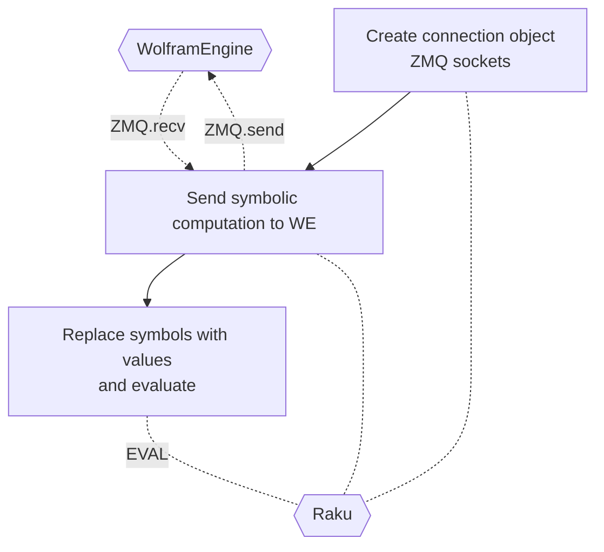

# Raku Proc::ZMQed

This package, "Proc::ZMQed", provides external evaluators (Julia, Mathematica, Python, R, etc.) via 
[ZerpMQ (ZMQ)](https://zeromq.org).

Functionality-wise, a closely related Raku package is 
["Text::CodeProcessing"](https://raku.land/zef:antononcube/Text::CodeProcessing), 
[AAp1].

-----

## Mathematica 

*...aka Wolfram Language (WL).*

The following examples shows:

- Establishing connection to [Wolfram Engine](https://www.wolfram.com/engine/) (which is free for developers.)

- Sending a formula for symbolic algebraic expansion.

- Getting the symbolic result and evaluating it as a Raku expression.

```perl6
use Proc::ZMQed::Mathematica;

# Make object
my Proc::ZMQed::Mathematica $wlProc .= new(url => 'tcp://127.0.0.1', port => '5550');

# Start the process (i.e. Wolfram Engine)
$wlProc.start-proc;

my $cmd = 'Expand[(x+y)^4]';
my $wlRes = $wlProc.evaluate($cmd);
say "Sent : $cmd";
say "Got  :\n $wlRes";

# Send computation to Wolfram Engine
# and get the result in Fortran form.
say '-' x 120;
$cmd = 'FortranForm[Expand[($x+$y)^4]]';
$wlRes = $wlProc.evaluate($cmd);
say "Sent : $cmd";
say "Got  : $wlRes";

# Replace symbolic variables with concrete values 
my $x = 5;
my $y = 3;

use MONKEY-SEE-NO-EVAL;
say 'EVAL($wlRes) : ', EVAL($wlRes);

# Terminate process
$wlProc.terminate;
```
```
# Sent : Expand[(x+y)^4]
# Got  :
#   4      3        2  2        3    4
# x  + 4 x  y + 6 x  y  + 4 x y  + y
# ------------------------------------------------------------------------------------------------------------------------
# Sent : FortranForm[Expand[($x+$y)^4]]
# Got  : $x**4 + 4*$x**3*$y + 6*$x**2*$y**2 + 4*$x*$y**3 + $y**4
# EVAL($wlRes) : 4096
```

**Remark:** Mathematica can have variables that start with `$`, which is handy if we want to
tre WE results as Raku expressions.

Here is a corresponding flowchart:



------

## Implementation details

There is a general role "Proc::ZMQed::Abstraction" that combines the design patterns 
Builder, Template Method, and Strategy. Here is the corresponding UML diagram:

```perl6, output-lang=mermaid, output-prompt=NONE
use UML::Translators;
to-uml-spec(<Proc::ZMQed::Abstraction Proc::ZMQed::Julia Proc::ZMQed::Mathematica Proc::ZMQed::Python Proc::ZMQed::R Proc::ZMQed::Raku>, format=>'mermaid');
```
```mermaid
classDiagram
class Failure.new(exception => X_NoSuchSymbol.new(symbol => "Proc_ZMQed_Julia"), backtrace => Backtrace.new) {
  <<constant>>
}
Failure.new(exception => X_NoSuchSymbol.new(symbol => "Proc_ZMQed_Julia"), backtrace => Backtrace.new) --|> Nil


class Proc_ZMQed_Mathematica {
  +$!codeOption
  +$!context
  +$!port
  +$!proc
  +$!receiver
  +$!scriptName
  +$!url
  +BUILD()
  +BUILDALL()
  +codeOption()
  +context()
  +evaluate()
  +make-code()
  +port()
  +proc()
  +process-setup-lines()
  +receiver()
  +scriptName()
  +start-proc()
  +terminate()
  +url()
}
Proc_ZMQed_Mathematica --|> Proc_ZMQed_Abstraction


class Proc_ZMQed_Python {
  +$!codeOption
  +$!context
  +$!port
  +$!proc
  +$!receiver
  +$!scriptName
  +$!url
  +BUILD()
  +BUILDALL()
  +codeOption()
  +context()
  +evaluate()
  +make-code()
  +port()
  +proc()
  +process-setup-lines()
  +receiver()
  +scriptName()
  +start-proc()
  +terminate()
  +url()
}
Proc_ZMQed_Python --|> Proc_ZMQed_Abstraction


class Proc_ZMQed_R {
  +$!codeOption
  +$!context
  +$!port
  +$!proc
  +$!receiver
  +$!scriptName
  +$!url
  +BUILD()
  +BUILDALL()
  +codeOption()
  +context()
  +evaluate()
  +make-code()
  +port()
  +proc()
  +process-setup-lines()
  +receiver()
  +scriptName()
  +start-proc()
  +terminate()
  +url()
}
Proc_ZMQed_R --|> Proc_ZMQed_Abstraction


class Proc_ZMQed_Raku {
  +$!codeOption
  +$!context
  +$!port
  +$!proc
  +$!receiver
  +$!scriptName
  +$!url
  +BUILD()
  +BUILDALL()
  +codeOption()
  +context()
  +evaluate()
  +make-code()
  +port()
  +proc()
  +process-setup-lines()
  +receiver()
  +scriptName()
  +start-proc()
  +terminate()
  +url()
}
Proc_ZMQed_Raku --|> Proc_ZMQed_Abstraction
```

(Originally, "Proc::ZMQed::Abstraction" was named "Proc::ZMQish", but the former seems a better fit for the role.)

The ZMQ connections are simple REP/REQ. It is envisioned that more complicated ZMQ patterns can be implemented in
subclasses. I have to say though, that my attempts to implement 
["Lazy Pirate"](https://zguide.zeromq.org/docs/chapter4/)
were very unsuccessful because of the half-implemented (or missing) polling functionalities in [ASp1].
(See the comments [here](https://github.com/arnsholt/Net-ZMQ/blob/master/lib/Net/ZMQ4/Poll.pm6).)


------

## References

### Packages

[AAp1] Anton Antonov
[Text::CodeProcessing Raku package](https://github.com/antononcube/Raku-Text-CodeProcessing),
(2021-2022),
[GitHub/antononcube](https://github.com/antononcube).

[ASp1] Arne Skjærholt,
[Net::ZMQ](https://github.com/arnsholt/Net-ZMQ),
(2017),
[GitHub/arnsholt](https://github.com/arnsholt).
